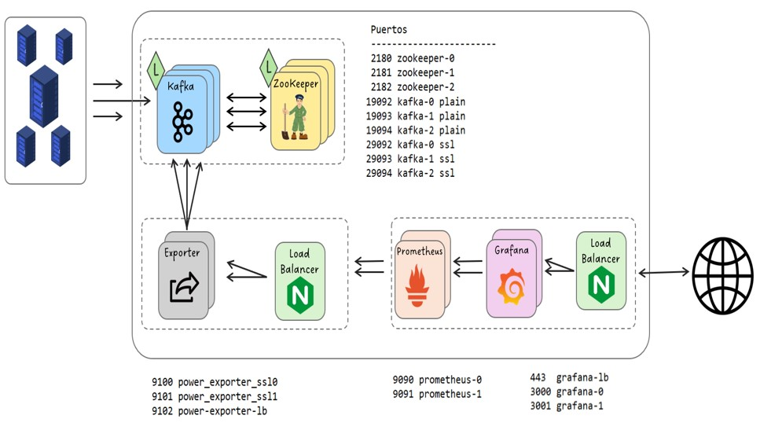

# Production PowerConsumptionMonitoring

This project is an example how to use Cloud and Virtualization technologies for system observability in a production environment

Integration of different tools to collect, process, store and display information regarding the power consumption of OLTs. An OLT is a Telecom network equipment used to deliver fiber to the home broadband services.

This repository is based on my https://github.com/Ivantg01/PowerConsumptionMonitoring repository and adds security, data redundancy, load balancing and cloud mechanishms.

Kafka cluster with SSL configuration uses the great guides available at https://jaehyeon.me/blog/2023-07-06-kafka-development-with-docker-part-9/ 

## Tools used:
 
* Kafka+Zookeeper to send and receive power consumption metrics in JSON format  
* Prometheus to store the collected information as time series 
* Grafana to build and display multiple dashboard 
* Docker to run all components used
* Nignx as a load balancer
* SSL for Kafka producer and consumer clients
* HTTPS for Grafana access via internet

## Folder structure:
* ```kafka-cluster-ssl```: Kafka bus to send and consume power consumption metrics working in cluster and with SSL enabled
 
* ```power-producer-ssl```: metric generator based on generic public information and GPS coordinates calculated from location names using OpenStreetMap API

* ```power-exporter-ssl```: docker definitions for Prometheus and Grafana working in cluster
  
* ```power-exporter-ssl```: program to export metrics from Kafka to Prometheus with 2 exporter instances and a load balancer

</img>

## Notes
* Kafka generated certificates are autosigned
* Grafana HTTPS generated certificate is autosigned.
* Free signed certificates for 90 days can be generated in https://www.sslforfree.com/
* Free DNS names for can be obtained in https://freedns.afraid.org
* Free cloud resources can be obtained in Google Cloud Platform. This project has been deployed in GCP using an e2 VM with 2vCPU, 8GB RAM, 40GB SSD
   
## Grafana screenshots 
Grafana has been connected to Prometheus and different dashboards have been created: 

</img>
</img>
</img>
</img>
</img>
</img>
</img>
